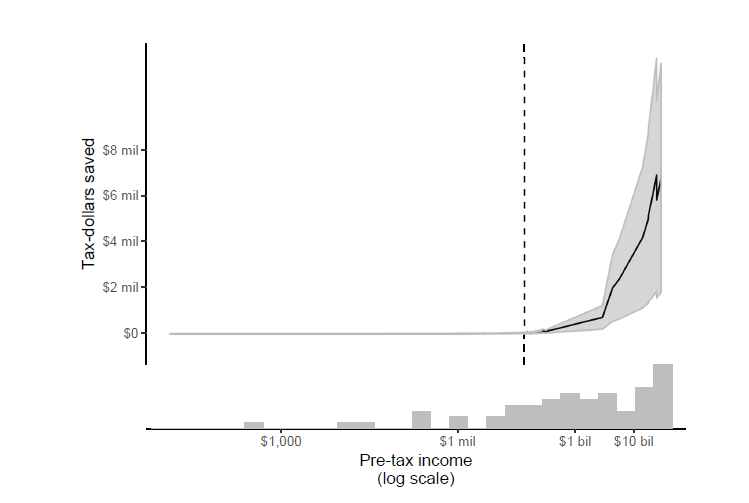
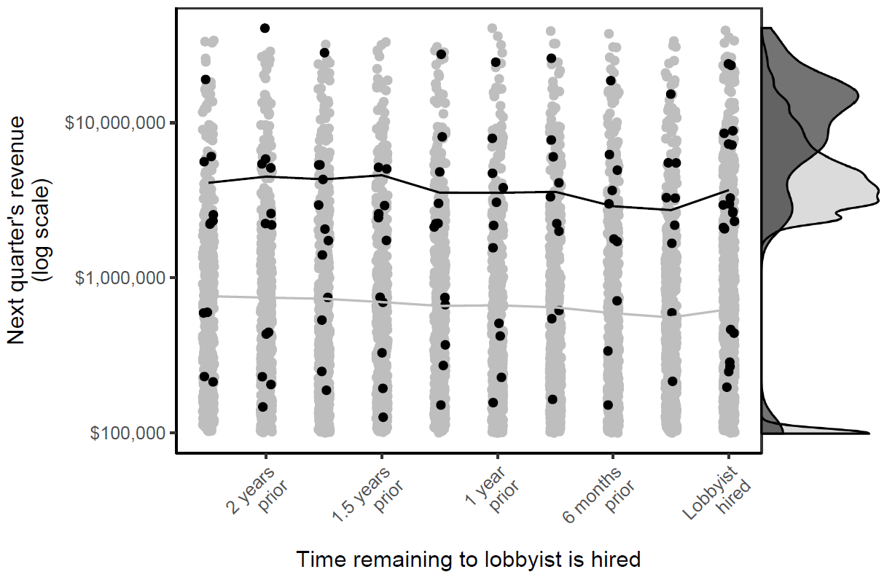
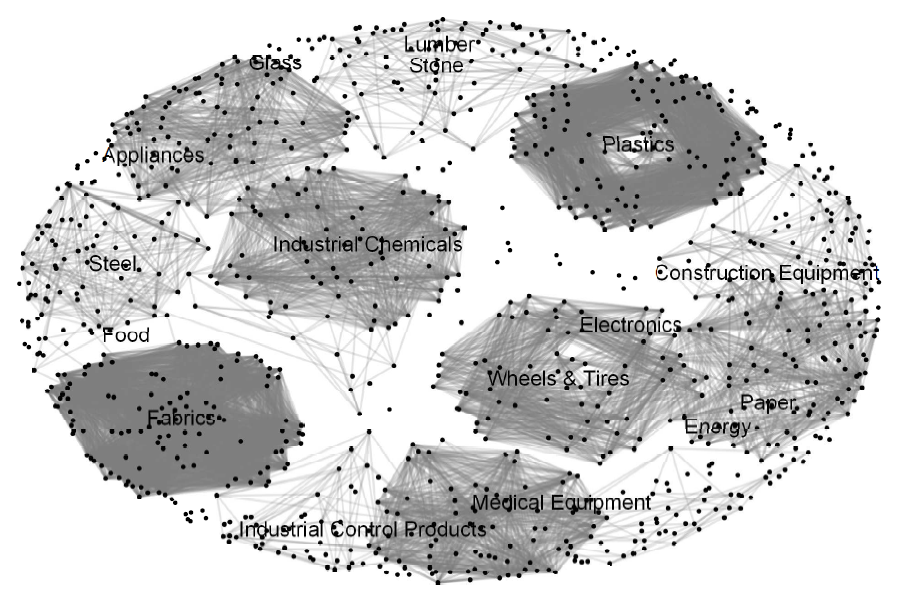
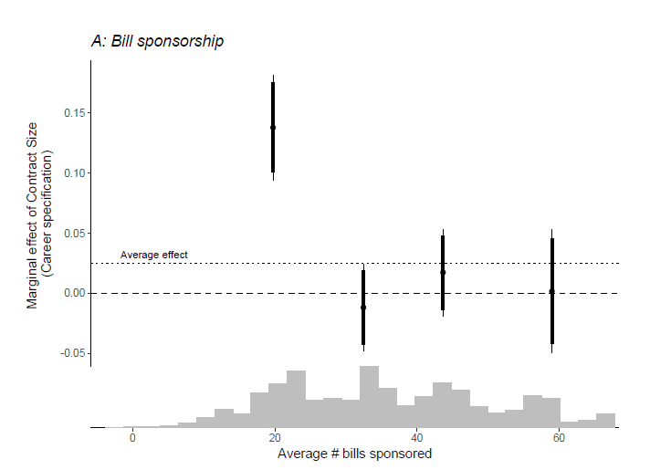
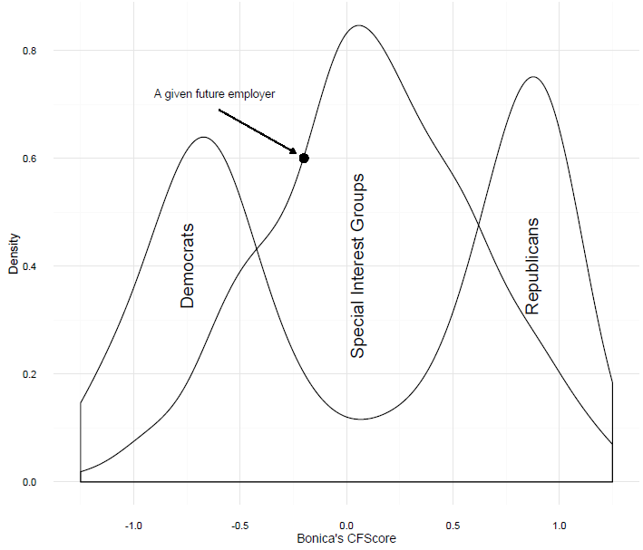
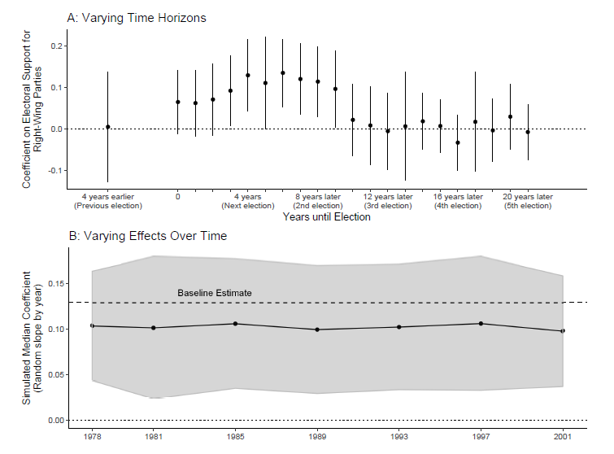

 
 
My research interests revolve around four main themes: 1) Political connections and corporate political influence, 2) revolving door politics, 3) political responsiveness and 4) measurement. Below, I detail my research within each topic.

 

### Political Connections and Corporate Influence on Public Policy

Something insightful on corporate political activity ..

 &nbsp;  <a href="https://github.com/BCEgerod/BCEgerod.github.io/blob/master/papers/TaxDraft.pdf">The Revolving Door and Taxes -- Political Connections Decrease Corporate Tax Rates</a>
 

I investigate the effect of political connections on regulatory forbearance by examining the interactions between firms and the Internal Revenue Service. <!DOCTYPE html>
<html>
<head>
<meta name="viewport" content="width=device-width, initial-scale=1">

</head>
<body>

<button style="color:black" class="collapsible">Open Abstract</button>

  
For fear of retribution, agencies may enforce rules more leniently against firms with
political connections. I test the argument as it pertains to the enforcement of
tax policy by the Internal Revenue Service (IRS). I compile a novel database of
publicly listed firms, that have hired Members of the US Congress (MCs) in any
capacity in the period 2004-2015. I present evidence that hiring a former MC
decreases the average company's tax rate by a large margin relative the the changes,
the average firm normally experiences. The reduction is short-lived, but yields
meaningful tax-savings for the individual firm, while only modestly impacting public
finances. I show that the effect is driven by the MCs, who have the strongest
political connections, and served in committees with oversight of the IRS. I present
suggestive evidence that firms that hire highly connected MCs substitute away from
traditional forms of lobbying, and are invited to hearings more often. This is likely
to pressure the IRS in their decision-making. These results indicate that firms can
use the revolving door to pursue significant economic rents.

</body>
</html>

 
 
 
 
 
 

 &nbsp;  <a href="https://github.com/BCEgerod/BCEgerod.github.io/blob/master/papers/LobbyistsGovernment.pdf">Lobbyists as Government Employees -- Evidence from the Bureaucracy</a>

*With Josh McCrain, Emory University*

Leveraging the staggered pattern of appointments into the Trump administration in a difference-in-difference design, we estimate the returns to connections to key rule makers in the bureaucracy for lobbying firms. <!DOCTYPE html>
<html>
<head>
<meta name="viewport" content="width=device-width, initial-scale=1">

</head>
<body>

<button style="color:black" class="collapsible">Open Abstract</button>

  
	A growing body of research examines the transition of government employees into the private sector, commonly known as the revolving door. A common conclusion in this work is that government employees cash in on their experience and, most importantly, their connections to current officials. We focus on two under-studied aspects of the revolving door: 1) the transition of lobbyists back *into* government and 2) the value of connections between lobbyists and government agencies. Exploiting the unexpected victory of Donald Trump in the 2016 presidential election and the staggered timing of appointments into his administration, we find that firms whose lobbyists went back through the revolving door saw 20-70\% increase in revenue, and the increase was larger in Democrat-leaning firms. Our results shed light onto the political economy of the lobbying industry and suggest a need to further study the interaction between lobbying firms and the federal bureaucracy.

 
 
 
 

 &nbsp;  <a href="https://github.com/BCEgerod/BCEgerod.github.io/blob/master/papers/AssetSpecificity.pdf">Asset specificity, corporate protection, and trade policy</a>

*With Mogens K Justesen, Copenhagen Business School*

Using firm-level data on petitions for antidumping protection from 22 WTO jurisdictions, we revisit classical question of whether firms with specific assets gain more protection. We also investigate intra-industry spill over effects.<!DOCTYPE html>
<html>
<head>
<meta name="viewport" content="width=device-width, initial-scale=1">

</head>
<body>

<button style="color:black" class="collapsible">Open Abstract</button>

  
	We examine the role of firms in shaping trade protection. Firms with specific assets find it more costly to reorganize production in the face of international competition, which makes them lobby more intensively for protection. But decision-makers will not grant unlimited trade protection. This forces companies to compete for protection, which causes it to diffuse within groups of same-good producers. To test this argument, we combine antidumping petitions with financial data on the firms filing them in a unique dataset. Using spatial autoregressive models, we show that companies with specific assets are more likely to be successful when petitioning for antidumping protection and that this decreases protection afforded to competing firms.

 
 
 
 
 
 

### Revolving Door Politics

It routinely attracts both attention and condemnation, when elected officals leave office to take jobs in the private sector. Despite this, we know very little about, whether the so-called revolving door between business and politics changes policy outcomes. In my dissertation, I investigate how 1) the potential for post-elective employment shapes the behavior of US Members of Congress, and 2) firms that hire former Members of Congress can ...

 &nbsp;  <a href="https://github.com/BCEgerod/BCEgerod.github.io/blob/master/papers/TheLure.pdf">The Lure of the Private Sector -- Career Prospects Affect Selection out of the Senate</a>

I investigate the effect of private sector career prospects on whether US senators choose to walk through the revolving door.  <!DOCTYPE html>
<html>
<head>
<meta name="viewport" content="width=device-width, initial-scale=1">

</head>
<body>

<button style="color:black" class="collapsible">Open Abstract</button>

  
While it is often conjectured that private sector salaries lure elected politicians out of public service, no quantitative evidence exists on this proposition. If private sector actors compete with the electorate for the labor of high-skilled politicians, it would have important implications for representative democracy. I argue that legislators gauge their private sector career prospects by observing how successful their former colleagues, who now work as lobbyists, are. I document that when career prospects improve, so does the probability that senators take a lobbying job.  There is no effect immediately before a senator's pension scheme improves. Senators, who retire from working life after Congress or are elected to a safe seat, are also unaffected.  Finally, senators, who have sponsored the least bills and are more absent for floor votes, are affected the most. All of this indicates that senators react to opportunity costs associated with being in office.

 
 
 
 
 
 
 
 

 &nbsp;  <a href="https://github.com/BCEgerod/BCEgerod.github.io/blob/master/papers/VotingForACareer.pdf">Voting for a Career -- The Revolving Door Moderates the Senate</a>

I examine how the final term voting of senators change, when they are about to walk through the revolving door. They moderate their roll call voting and converge to the ideal point of their future employers.<!DOCTYPE html>
<html>
<head>
<meta name="viewport" content="width=device-width, initial-scale=1">

</head>
<body>

<button style="color:black" class="collapsible">Open Abstract</button>

  
	I investigate how the revolving door affects voting in the Senate. The literature on final-term problems suggests that senators should become more extreme before they leave office, because they no longer are accountable to voters. Lack of electoral accountability could, however, have different effects depending on the senator's career ambitions. While retiring senators are no longer accountable to anyone but themselves, revolving door politicians will be accountable to their future employers, because they depend on them for post-elective employment. During their final Congress, this should lead revolving door senators to moderate themselves, while retiring ones should grow more partisan. Using data on post-elective career trajectories from 102nd to the 113th Senate, I present fixed effects estimates that back this claim. I show that the effect is driven by senators, who choose to resign, and provide evidence suggesting that the shift happens, because senators anticipate the preferences of their future employer.

 
 
 
 
 
 
 
 
 
 

### Political Responsiveness

Something about responsiveness.

 &nbsp;  <a href="https://github.com/BCEgerod/BCEgerod.github.io/blob/master/papers/DanishMuni.pdf">Can Citizens Set City Policy? Evidence From A Decentralized Welfare State </a>

*With Martin Vinæs Larsen, Aarhus University.*

We show that local fiscal policy in Denmark responds strongly to voter preferences. The effect of a preference changes lasts as long as nine years into the future. <!DOCTYPE html>
<html>
<head>
<meta name="viewport" content="width=device-width, initial-scale=1">

</head>
<body>

<button style="color:black" class="collapsible">Open Abstract</button>

  
 Municipal governments supposedly empower citizens, giving them the ability to shape the political organization of their local community. In spite of this, we know little about whether municipal governments are in fact responsive to the policy views of municipal electorates. In this study, we look at whether the policy implemented by local politicians actually responds to changes in the public mood. To do this, we compile a unique and comprehensive dataset of local fiscal policy, which we use to construct municipal-level estimates of fiscal policy conservatism. This detailed policy data is then linked to an indicator of local ideological sentiment. We find strong evidence for dynamic responsiveness: when preferences in a municipality changes public policy responds.

 
 
 
 
 
 
 

### Political Methodology and Measurement

Something on methods and measurement

Scaling Political Positions from Text -- Assumptions, Methods and Pitfalls

*With Robert Klemmensen, University of Southern Denmark*

*Chapter in: Luigi Curini & Robert Franzese (Eds.): SAGE Handbook of Research Methods in Political Science & International Relations (Forthcoming).*

We review standard methods for scaling political positions from text. We outline how the techniques relate to measurement theory in general, review assumptions and illustrate their use. <!DOCTYPE html>
<html>
<head>
<meta name="viewport" content="width=device-width, initial-scale=1">

</head>
<body>

<button style="color:black" class="collapsible">Open Abstract</button>

  
 The abstract.

</body>
</html>