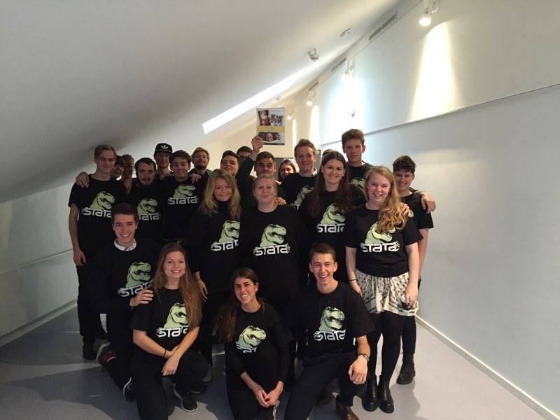

---
---

 
 
 

 
 
 
 
 
 
 
 
 
 
 
 
 

####Nominations:

- *Teaching Excellence Award, Department of Political Science, University of Copenhagen*:
2014/15, 2015/16, 2017/18

- *Teacher of the Year, University of Copenhagen*:
2014/15

I have taught seminars for 30-60 undergraduates on political methodology covering topics ranging from introductory statistics over linear and logistic regression analysis to interview technique. I also give lectures for more than 200 undergraduates on descriptive statistics and regression analysis. To that end, I have written <a href="https://github.com/BCEgerod/BCEgerod.github.io/blob/master/papers/Lecture_Note.pdf"> teaching materials </a> introducing students to the Gauss-Markov Theorem in Danish. I teach the applied parts of the methods courses in both R and Stata.

I have supervised Master's theses on a diverse set of subjects, among others process tracing methods to analyze policy outcomes and statistical analyses of educational choices in the population of Danish citizens.

In the fall of 2019, I will be teaching a graduate course in Political Data Science.

The photo to the left is of the students in my 2015/16 methods class, who brought their Stata merchandise to class one day.

